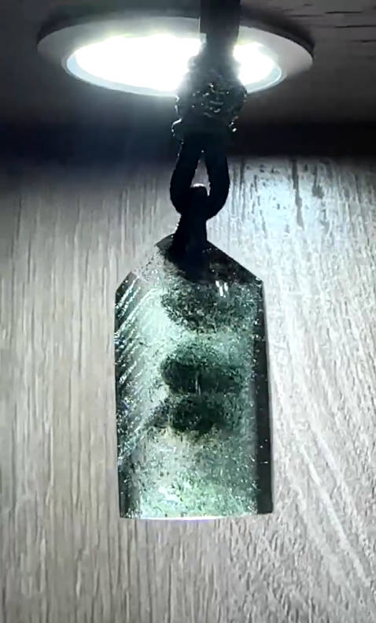

<!DOCTYPE html>
<head>
	<title>C10933043 陳鈊娜</title>
	<meta charset="UTF-8">
	<meta name="viewport" content="width=device-width, initial-scale=1.0">
	<!--------------------------------------這些是CSS設定--------------------------------------->
	<link rel="stylesheet" href="css/bootstrap.min.css"/>
	<link rel="stylesheet" href="css/font-awesome.min.css"/> <!--臉書等小圖示-->
	<link rel="stylesheet" href="css/slicknav.min.css"/>
	<link rel="stylesheet" href="css/fresco.css"/>
	<link rel="stylesheet" href="css/slick.css"/>
	<link rel="stylesheet" href="css/style.css"/>
	<!---------------------------------------------------------------------------------------->
</head>
<body>
	<!-- 執行預先載入的工作 -->
	

		

	

	<!-- 標頭區塊 -->
	<header class="header">
		

			

				

					

						<a href="https://zh-tw.facebook.com/netflix"><i class="fa fa-facebook"></i></a>
						<a href="https://twitter.com/netflix"><i class="fa fa-twitter"></i></a>
						<a href="https://www.instagram.com/netflixtw/?hl=zh-tw"><i class="fa fa-instagram"></i></a>
					

				

				

					
				

			

			<nav class="main__menu">
				<ul class="nav__menu">
					<li><a href="./index.html" class="button">Home</a></li>
					<li><a href="./name.html" class="button">About</a></li>
					<li><a href="./habits.html" class="button">Hobbies</a></li>
					<li><a href="./final.html"class="button">Bucket List </a></li>
					<li><a href="./contact.html"class="button">Contact</a></li>
				</ul>
			</nav>
		

	</header>
	<!-- 標頭區塊結束 -->

	<!-- 利用brootstrap的Hero Section讓圖片產生旋轉木馬效果 -->
	<section class="hero__section">
		

			

				
			

			

				
			

			

					
			

			

					
			

			

					
			

			

					
			

			

					
			

		

		

			

				<h2>Emily in Paris</h2>
				
You live to work, we work to live. 

			

			

				<h2>The Queen's Gambit</h2>
				
Intuition can't be found in books.

			

			

				<h2>The Umbrella Academy</h2>
				
Maybe your appetite is disproportionate to the size of your abilities.

			

			

				<h2>Designated Survivor</h2>
				
There are times when we make history, and there are times when history makes us.

			

			

				<h2>Dash & Lily</h2>
				
If you really care about her, you need to go to her as you.

			

			

				<h2>YOU</h2>
				
I'm not an option, I'm the chosen one.

			

			

				<h2>Black Mirror</h2>
				
I never expected to live in the future, but I am in the future now.

			

		

	</section>
	<!-- 圖片旋轉效果結束 -->

	<!-- 頁尾區塊 -->
	<footer class="footer__section">	
		
	
			

				<Video autoplay controls>
    			<source src="music/04.mp3" />
			    </Video>
				
Copyright &copy;  All rights reserved | This template is made with <em class="fa fa-heart" aria-hidden="true"></em> by<a href="mailto:c10933043@gapps.uch.edu.tw" target="_blank"> C10933043 Regina C</a>

			

		

	</footer>
	<!-- 頁尾區塊結束-->

	<!--====== Javascripts & Jquery ======-->
	
	
	
	
	
	
	</body>
</html>
